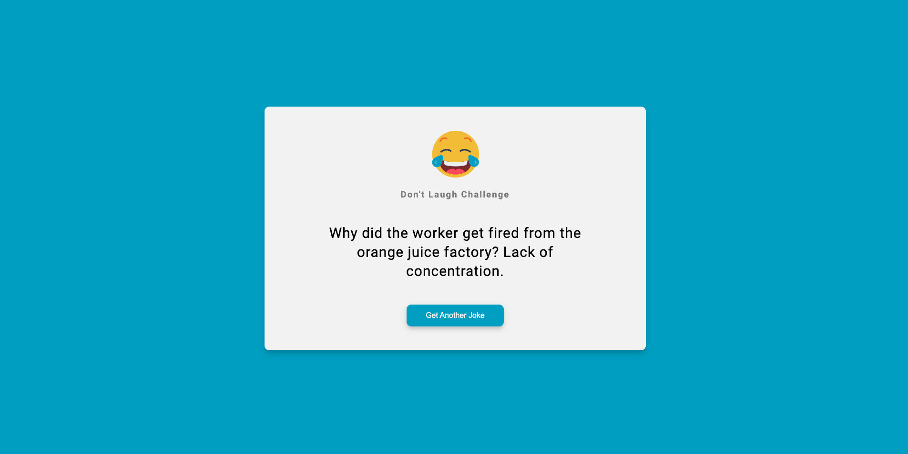

# webpack-joke-app

Live demo: https://dontlaughchallengewithwebpack.netlify.app/

The app is a joke generator by using webpack with vanilla js.

Includes the following features:

- Babel Loader
- Sass Loader With Dart Sass
- HTMLWebpackPlugin
- WebpackDevServer
- Asset Resource Loader
- Source Maps
- Caching

  # Screenshot



## Usage

Run Dev Server (Port 3000)

```
  npm run dev
```

## Build for production

```
npm run build
```
